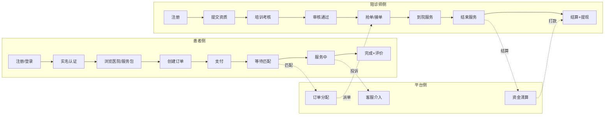
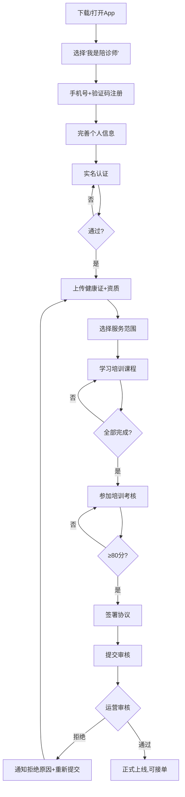
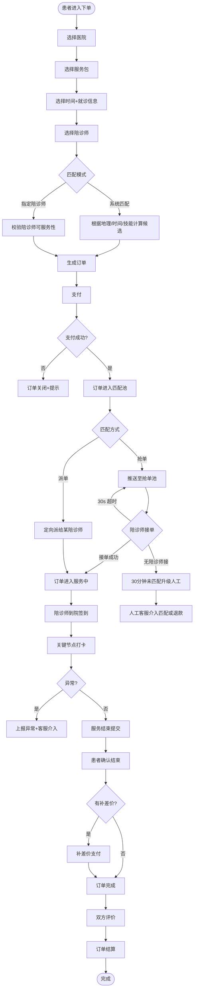
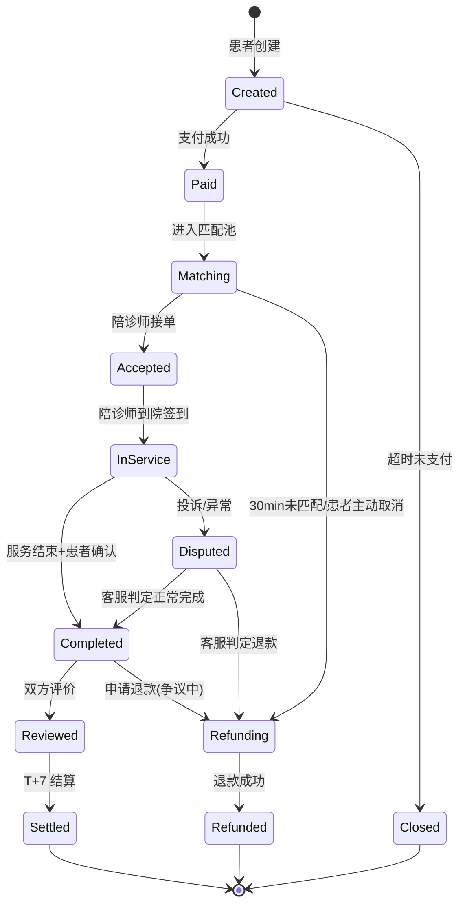
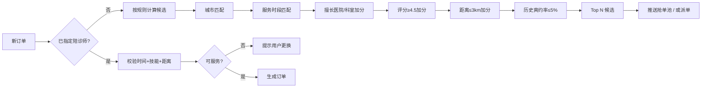
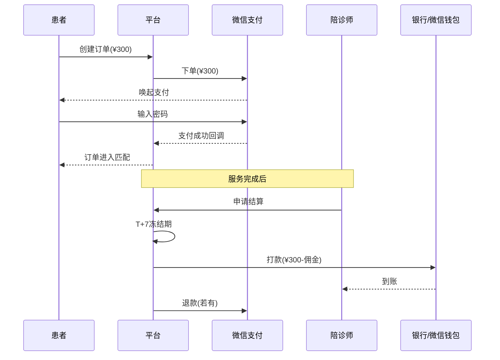
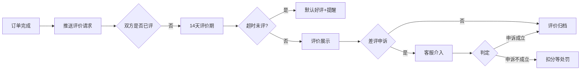
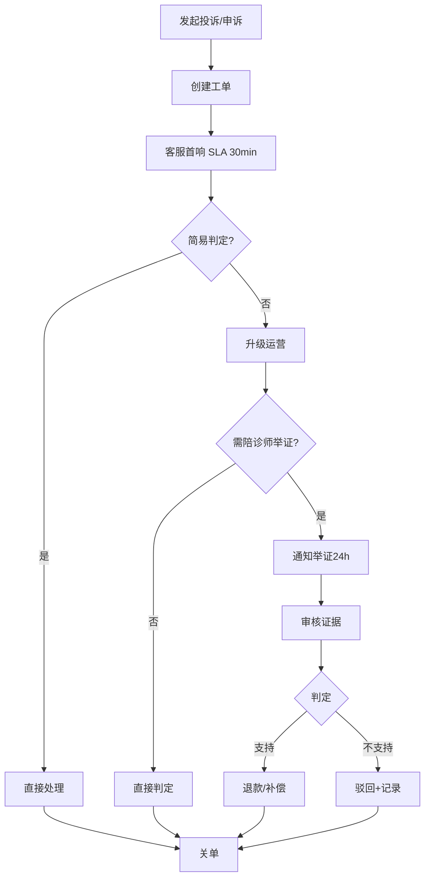
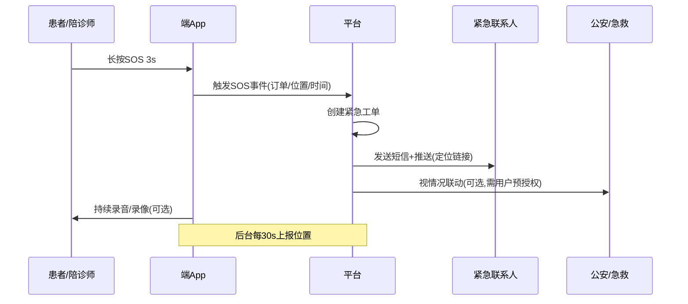

# 04 · 业务流程

> 本章用 mermaid 描述核心端到端流程。  
> 业务状态机、订单流转、资金流向在这里统一约定。

---

## 4.1 业务全景



---

## 4.2 陪诊师入驻流程（详细）



---

## 4.3 患者下单 → 服务完成（端到端主流程）



---

## 4.4 订单状态机



> 任何状态变更都需写入 `order_event` 表，作为时间线和审计依据。

---

## 4.5 智能匹配规则（v1 简版）



> v1.0 使用规则匹配；v2.0 引入 ML 模型做最优匹配。

---

## 4.6 支付与结算



**资金要点**：

- 平台账户与用户资金严格隔离，**禁止挪用**用户预付款（合规要求）
- 抽佣比例可配置（默认 20%）
- 退款规则：
  - 未匹配：全额退
  - 已匹配未开始：扣 20% 陪诊师占位费
  - 服务开始后：按已完成节点比例结算，剩余退款

---

## 4.7 评价流程



---

## 4.8 投诉与申诉



---

## 4.9 紧急安全（SOS）



---

## 4.10 提现流程（陪诊师）

```mermaid
flowchart LR
  A[发起提现] --> B{可提现余额≥100?}
  B -- 否 --> N1[提示最低金额]
  B -- 是 --> C[校验实名+绑定卡]
  C --> D[风控校验]
  D --> E{通过?}
  E -- 否 --> N2[提示风险拒绝]
  E -- 是 --> F[创建提现工单]
  F --> G[财务审核(自动/人工)]
  G --> H[调用微信/银行打款]
  H --> I[到账通知]
```

---

## 4.11 异常分支汇总

| 场景 | 触发 | 处理 |
| :-- | :-- | :-- |
| 支付失败 | 网络 / 余额不足 | 重试或换支付方式 |
| 30 分钟未匹配 | 抢单池无响应 | 自动扩大匹配范围；30min 后人工介入 |
| 陪诊师迟到 > 15min | GPS 时间比对 | 自动通知患者 + 客服介入改派 |
| 陪诊师拒绝服务 | 接单后取消 | 扣信用分；订单回到匹配池 |
| 患者爽约 | 陪诊师到院签到后 30min 患者未出现 | 通知患者 → 自动结单 → 部分退款 |
| 服务中突发 | 双方任一上报 | 客服介入 |
| 投诉差评 | 评价 ≤ 3 星 | 客服介入 → 申诉通道 |
| 退款争议 | 任一方发起 | 工单处理；必要时法务介入 |

---

## 4.12 后续章节指引

- 实现上述流程的性能 / 安全 / 合规底线 → 读 [05 · 非功能需求](./05-非功能需求.md)
- 系统如何支撑这些流程 → 读 [06 · 系统架构](./06-系统架构.md)
