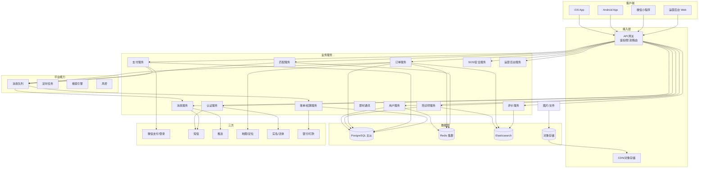
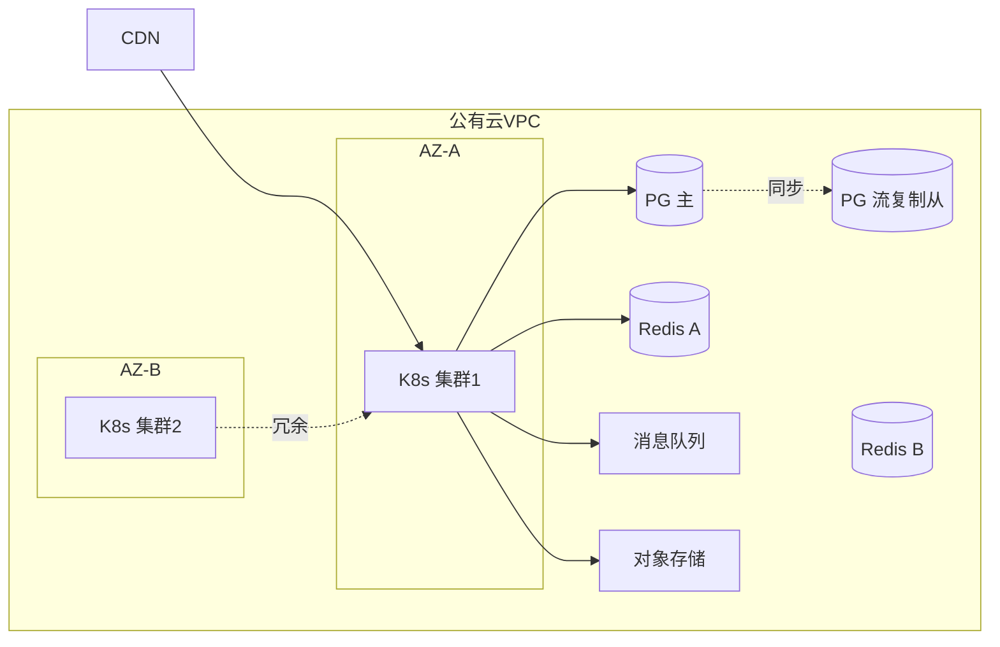

# 06 · 系统架构

> 本章描述总体架构、技术选型建议与部署架构。  
> 技术选型在 v1.0 中保持**推荐而非强约束**，团队可根据自身技术栈调整；架构原则与边界**不可妥协**。

---

## 6.1 架构原则

1. **业务边界清晰**：用户域、订单域、陪诊师域、支付域、运营域各自独立。
2. **数据一致性优先**：订单 / 支付强一致；其它最终一致即可。
3. **可灰度、可回滚**：每次发布必须支持按城市 / 按版本灰度，秒级回滚。
4. **可观测**：全链路 TraceID，所有关键路径埋点。
5. **安全默认开启**：HTTPS、加密存储、审计日志默认开，不允许"先关闭、上线后再开"。
6. **合规优先于效率**：任何会触碰"陪诊 = 诊疗"边界的设计必须改。

---

## 6.2 总体架构图



---

## 6.3 服务拆分（v1 推荐）

| 服务 | 职责 | 关键接口 |
| :-- | :-- | :-- |
| **user-service** | 患者 / 陪诊师档案、实名、地址 | `POST /users`、`GET /users/me` |
| **auth-service** | 登录、Token、验证码 | `POST /auth/login` |
| **escort-service** | 陪诊师入驻、资质、培训、状态 | `POST /escorts/apply` |
| **order-service** | 订单创建、状态机、查询 | `POST /orders`、`POST /orders/{id}/cancel` |
| **match-service** | 候选计算、抢单池、派单 | `GET /match/candidates` |
| **payment-service** | 微信下单、回调、对账 | `POST /payments/create` |
| **billing-service** | 抽佣、提现、结算 | `POST /withdrawals` |
| **review-service** | 评价、申诉 | `POST /reviews` |
| **message-service** | 通知聚合、模板管理 | `POST /messages/dispatch` |
| **sos-service** | SOS 事件、行程上报 | `POST /sos/trigger` |
| **admin-service** | 运营后台 CRUD、报表 | 管理后台专用 |

> 服务之间通过 **HTTP/gRPC + 内部 RPC**，关键链路走 **同步调用 + 幂等**；非关键走 MQ 异步。
> 所有业务服务统一用 Go 编写；后端编译产出**单二进制 + scratch/distroless 镜像**，冷启动 < 500ms，K8s HPA 友好。

### 6.3.1 Go 服务基线

| 项 | 选型 | 说明 |
| :-- | :-- | :-- |
| 语言版本 | Go 1.22+ | 启用泛型、`slices/maps` 标准库 |
| HTTP 框架 | Hertz (CloudWeGo) / Gin | 推荐 Hertz（字节开源，吞吐更高） |
| RPC | gRPC + protobuf | 内部服务调用统一 gRPC |
| ORM / DB 访问 | sqlc + pgx | sqlc 生成类型安全 SQL；pgx 高性能 PG 驱动 |
| 配置 | Viper + Nacos | 本地 + 远端配置双源 |
| 日志 | zap + zerolog | 结构化 JSON 日志 |
| 监控埋点 | OpenTelemetry → Prometheus | TraceID 全链路串联 |
| 测试 | testify + gomock | 单元测试覆盖率 ≥ 70% |
| 微服务脚手架 | go-kratos / go-zero | 二选一，团队习惯优先 |
| 依赖注入 | Wire (Google) | 编译期 DI |

---

## 6.4 关键技术选型（v1 锁定）

| 层 | 推荐 | 备选 | 备注 |
| :-- | :-- | :-- | :-- |
| **后端语言** | **Go 1.22+** | — | v1 锁定 Go；Java 仅历史服务共存 |
| **HTTP 框架** | Hertz / Gin | Echo / Chi | 推荐 Hertz（高性能） |
| **RPC** | gRPC | — | 内部服务必用 |
| **数据库** | **PostgreSQL 16+** | — | v1 锁定 PG（详见 6.4.1） |
| **数据库驱动** | pgx v5 + sqlc | GORM | sqlc 类型安全；GORM 仅工具型服务可用 |
| **连接池** | pgxpool | — | 调优 max conn / min conn / health check |
| **高可用** | Patroni + etcd | PgBouncer + 自研 | Patroni 仲裁主从自动切换 |
| **缓存** | Redis 7 集群 | KeyDB | 与 Go 配合良好 |
| **MQ** | Kafka | RocketMQ / RabbitMQ | Kafka + Go 生态成熟 |
| **搜索引擎** | Elasticsearch 8 | — | PG `tsvector` 可降级 |
| **注册中心** | Nacos | Consul | 兼容 Java 历史服务 |
| **配置中心** | Nacos / Apollo | — | |
| **监控** | Prometheus + Grafana + SkyWalking | — | OTel SDK 直连 |
| **日志** | ELK（ES + Logstash + Kibana） | Loki | |
| **CI/CD** | GitHub Actions + ArgoCD | GitLab CI | |
| **部署** | Kubernetes（ACK / TKE） | Docker Swarm | |
| **对象存储** | 阿里云 OSS / 腾讯云 COS | MinIO | |
| **小程序原生** | uni-app / Taro（可选） | 原生 | 三端共用业务能力 |
| **App** | Flutter / React Native（可选） | 原生 | |

> 三端共用后端 API，移动端优先保证**小程序**体验，App 提供同等核心能力。
> Go + PostgreSQL 是 v1 的**默认技术栈**；偏离需要架构评审。

### 6.4.1 PostgreSQL 关键能力利用

| 能力 | 用途 | 对比 MySQL 优势 |
| :-- | :-- | :-- |
| JSONB | `order.ext`、`escort.service_cities` 等灵活字段 | 索引、约束、查询能力强 |
| `tsvector` + GIN | 全文检索（医院、科室、评价内容） | 可降级 ES |
| `LISTEN/NOTIFY` | 抢单池事件通知（同 DB 实例内） | 替代部分 Redis Pub/Sub |
| `SELECT … FOR UPDATE SKIP LOCKED` | 抢单并发（行级锁跳过已锁行） | 比 MySQL 的 `SELECT ... FOR UPDATE` 更适合抢单场景 |
| **流复制 + Patroni** | 主从自动切换，< 10s RTO | 比 MySQL 半同步 + MHA 更成熟 |
| **逻辑复制** | 数据迁移、灰度读 | 用于订单事件分发 |
| **WAL + 时间点恢复** | PITR，RPO ≤ 分钟级 | 比 MySQL binlog 更通用 |
| **pg_cron** | 定时任务（对账、清理） | 替代部分定时任务基础设施 |
| **PostGIS**（v2 扩展） | 医院 / 陪诊师地理查询 | MySQL 需 5.7+ 才支持且功能弱 |

### 6.4.2 抢单并发的 PG 落地方案（替代 SETNX）

```sql
-- 抢单原子操作（FOR UPDATE SKIP LOCKED）
BEGIN;
SELECT id, escort_id
  FROM orders
 WHERE id = $1
   AND status = 'matching'
   AND (locked_by IS NULL OR lock_expire_at < NOW())
 FOR UPDATE SKIP LOCKED;

UPDATE orders
   SET status = 'accepted',
       escort_id = $2,
       accepted_at = NOW(),
       version = version + 1
 WHERE id = $1
   AND status = 'matching';
COMMIT;
```

- 抢单并发由 DB 行锁 + 版本号双重保护
- 无需 Redis SETNX，单库内即原子；跨库时降级为 Redis 锁 + 消息串行化
- 配合 `version` 乐观锁防止 ABA

---

## 6.5 部署架构



- **多 AZ**：核心服务至少部署在 2 个 AZ
- **异地灾备**：每日 `pg_basebackup` 全量 + WAL archive 异步同步至异地机房
- **数据库 HA**：Patroni + etcd 仲裁，RTO < 10s；同步备库 `synchronous_standby_names` 保证 RPO = 0
- **灰度发布**：按城市 / 按用户标签灰度
- **配置热更新**：Nacos 配置中心
- **镜像**：Go 服务构建为 `distroless/static` 单镜像，含 CA 证书，体积 < 30MB
- **资源**：业务 Pod request=250m/256Mi，limit=1000m/1Gi；按 QPS 自动 HPA

---

## 6.6 移动端架构

### 6.6.1 小程序

```
┌─────────────────────────────┐
│  Page (WXML + WXSS)         │
├─────────────────────────────┤
│  Component（业务组件库）    │
├─────────────────────────────┤
│  Store（全局状态 / Mobx）   │
├─────────────────────────────┤
│  Service（API 封装）        │
├─────────────────────────────┤
│  Util（工具 / 埋点 / 上报） │
└─────────────────────────────┘
```

### 6.6.2 App（iOS / Android）

```
┌──────────────────────────┐
│  UI（Native / RN）       │
├──────────────────────────┤
│  ViewModel（业务逻辑）   │
├──────────────────────────┤
│  Repository（数据源）    │
├──────────────────────────┤
│  Network（API 客户端）   │
├──────────────────────────┤
│  Storage（DB / KV）      │
└──────────────────────────┘
```

---

## 6.7 安全架构

- **网络层**：WAF + DDoS 防护 + 安全组白名单
- **应用层**：网关层鉴权、限流、防爬
- **数据层**：敏感字段加密、SQL 审计、脱敏展示
- **运维层**：堡垒机 + 操作审计 + 最小权限
- **监控层**：异常登录 / 大额操作 / 异常 API 实时告警

---

## 6.8 后续章节指引

- 数据如何落到库 → 读 [07 · 数据模型](./07-数据模型.md)
- 接口如何对外提供 → 读 [08 · 接口需求](./08-接口需求.md)
