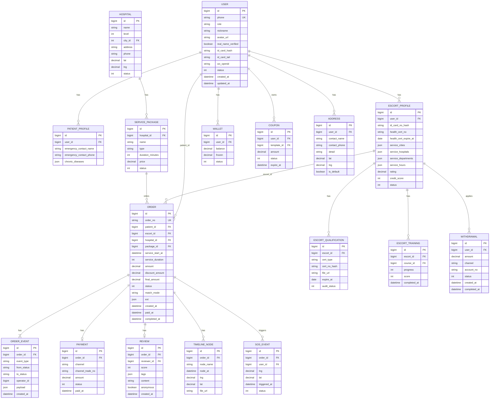

# 07 · 数据模型

> 本章列出核心实体的 ER 图与关键字段。  
> 字段命名遵循 `snake_case`，主键统一为 `id`（雪花 / UUID 自选），所有表带 `created_at` / `updated_at` / `deleted_at`（软删）。

---

## 7.1 ER 概览

---

## 7.2 关键实体字段说明

### 7.2.1 `user`（统一账号）

| 字段 | 类型 | 说明 |
| :-- | :-- | :-- |
| id | bigint PK | 雪花 ID |
| phone | varchar(20) UK | 手机号，唯一 |
| role | varchar(16) | `patient` / `escort` / `admin` |
| nickname | varchar(64) | 昵称 |
| avatar_url | varchar(255) | 头像 |
| real_name_verified | tinyint | 是否完成实名 |
| id_card_hash | varchar(64) | 身份证哈希 |
| id_card_tail | varchar(8) | 身份证末四位（展示用） |
| wx_openid | varchar(64) | 微信 openid |
| status | tinyint | 1=正常 2=冻结 3=注销 |
| created_at | datetime | 创建时间 |
| updated_at | datetime | 更新时间 |
| deleted_at | datetime | 软删 |

### 7.2.2 `escort_profile`（陪诊师档案）

| 字段 | 类型 | 说明 |
| :-- | :-- | :-- |
| user_id | bigint FK | 关联 user |
| health_cert_no | varchar(64) | 健康证编号（加密） |
| health_cert_expire_at | date | 健康证有效期 |
| service_cities | json | 可服务城市列表 |
| service_hospitals | json | 熟悉医院列表 |
| service_departments | json | 擅长科室 |
| service_hours | json | 可服务时段 |
| rating | decimal(3,2) | 平均评分 |
| credit_score | int | 信用分（满分 100） |
| status | tinyint | 1=待审核 2=培训中 3=待复核 4=已上线 5=停用 6=清退 |

### 7.2.3 `order`（订单）

| 字段 | 类型 | 说明 |
| :-- | :-- | :-- |
| order_no | varchar(32) UK | 业务订单号（前缀+时间+随机） |
| patient_id | bigint FK | 患者 |
| escort_id | bigint FK nullable | 陪诊师（匹配后回填） |
| hospital_id | bigint FK | 医院 |
| package_id | bigint FK | 服务包 |
| service_start_at | datetime | 服务开始时间 |
| service_duration | int | 分钟 |
| amount | decimal(10,2) | 应付总额 |
| discount_amount | decimal(10,2) | 优惠金额 |
| final_amount | decimal(10,2) | 实付金额 |
| status | varchar(32) | 见 04 状态机 |
| version | int | 乐观锁（每次状态变更 +1） |
| match_mode | varchar(16) | `auto` / `assign` / `self_choose` |
| ext | json | 病情描述、紧急联系人等扩展 |
| paid_at | datetime | 支付完成时间 |
| completed_at | datetime | 完成时间 |
| **lock_owner** | **bigint FK nullable** | **pending_acceptance 锁单持有者；见 04 状态机** |
| **lock_expire_at** | **datetime nullable** | **锁单超时时间；服务判定锁单是否过期** |

### 7.2.4 `payment`

| 字段 | 类型 | 说明 |
| :-- | :-- | :-- |
| order_id | bigint FK | 订单 |
| channel | varchar(16) | `wxpay` |
| channel_trade_no | varchar(64) | 微信交易号 |
| amount | decimal(10,2) | 金额 |
| status | tinyint | 1=待支付 2=成功 3=失败 4=已退款 |

### 7.2.5 `wallet` / `withdrawal`

- `wallet`：每个用户一个钱包，`balance` 可用余额，`frozen` 冻结金额（T+7 锁定）
- `withdrawal`：提现申请；状态机：1=待审核 2=审核通过 3=打款中 4=成功 5=失败 6=已撤销

---

## 7.3 状态机表

### 7.3.1 订单状态

参见 [04 · 业务流程 · 订单状态机](./04-业务流程.md#44-订单状态机)

| status | 含义 |
| :-- | :-- |
| created | 已创建未支付 |
| paid | 已支付 |
| matching | 匹配中 |
| **pending_acceptance** | **陪诊师锁单中（30s 窗口）** |
| accepted | 已接单 |
| in_service | 服务中 |
| completed | 已完成 |
| reviewed | 已评价 |
| refunding | 退款中 |
| refunded | 已退款 |
| **settling** | **结算中** |
| **disputed** | **争议中** |
| closed | 已关闭 |
| canceled | 已取消 |

### 7.3.2 陪诊师状态

| status | 含义 |
| :-- | :-- |
| draft | 资料填写中 |
| training | 培训中 |
| audit_pending | 待审核 |
| audit_rejected | 审核拒绝 |
| online | 已上线（可接单） |
| paused | 暂停（主动 / 平台） |
| banned | 清退 |

---

## 7.4 索引建议

- `user.phone` UNIQUE
- `user.wx_openid` UNIQUE
- `order.order_no` UNIQUE
- `order.patient_id` + `created_at` （复合 B-tree 索引）
- `order.escort_id` + `created_at`
- `order.status` + `service_start_at` （partial index `WHERE status IN ('matching','accepted','in_service')`）
- `escort_profile.status` + `city_id`
- `payment.channel_trade_no` UNIQUE
- `withdrawal.user_id` + `created_at`
- `review.order_id` UNIQUE
- `order.ext` GIN 索引（JSONB 灵活字段查询，PG 特性）
- `escort_profile.service_cities` GIN 索引（候选陪诊师地理筛选）
- `hospital.name` GIN trigram 索引（`pg_trgm` 模糊搜索）
- `review.content` GIN 索引（`tsvector` 全文检索，可降级 ES）

---

## 7.5 数据生命周期

| 数据 | 保留期 |
| :-- | :-- |
| 订单主数据 | 5 年（合规要求） |
| 支付 / 结算凭证 | 至少 5 年 |
| 实名 PII 哈希 | 账号注销后 30 天物理删除 |
| 操作日志 | 1 年在线 + 4 年归档 |
| 行程位置数据 | 服务完成后 90 天 |
| 评价 | 长期保留（脱敏展示） |

---

## 7.6 分库分表策略（v1.0 暂不实施，v2.0 引入）

### 7.6.1 v1.0 分区表（PG 原生）

| 表 | 分区策略 | 说明 |
| :-- | :-- | :-- |
| `order` | HASH 分区（按 `patient_id`，16 分区） | 单库内分区，跨分区查询由 PG 优化器处理 |
| `review` | RANGE 分区（按 `created_at`，月度） | 旧分区可冷归档到 OSS |
| `timeline_node` | HASH 分区（按 `order_id`，8 分区） | 写多读少 |
| `message` | RANGE 分区（按 `created_at`，月度） | 历史消息按月滚动 |

### 7.6.2 v2.0 跨库分片

| 表 | 分片键 | 分片数 | 方案 |
| :-- | :-- | :--: | :-- |
| order | user_id（patient） | 16 | `pgcat` / `Citus` |
| review | order_id 哈希 | 8 | Citus 分布式表 |
| timeline_node | order_id 哈希 | 8 | Citus 分布式表 |
| message | user_id | 8 | 按用户哈希 |

> v1.0 单库承载 ≤ 100 万订单无压力；超过则按 v2.0 方案扩展。

---

## 7.7 后续章节指引

- 数据如何对外暴露为 API → 读 [08 · 接口需求](./08-接口需求.md)
