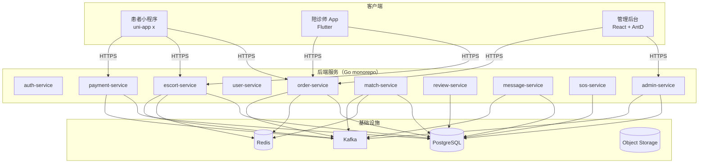

# 陪诊师平台

> MVP v1.0 全链路文档站：业务 / 架构 / Spec / Plan / 实施记录一站式查阅。

## 项目概览

陪诊师平台（Doctors / 陪诊服务）连接 **患者** 与 **陪诊师**：

- 患者下单 → 系统匹配 → **患者选陪诊师**（v1.1 选人模式，2026-09 重构）→ 陪诊师 30s 确认 → 服务 → 评价 → 完结。
- 陪诊师注册 → 实名 → 健康证 → 培训 → 审核 → 设置可服务时段 → 接收邀请（v1.1 选人模式）→ 服务。
- 平台提供后台审核、订单监控、退款策略、SOS 报警、虚拟号、消息等横切能力。

## v1.1 关键变更（订单匹配模式重构）

| 维度 | 旧版（v1 抢单） | 新版（v1.1 选人） |
|---|---|---|
| 触发方 | 陪诊师抢单 | 患者选人 + 陪诊师 30s 确认 |
| 状态机 | `matching → pending_acceptance` | `selecting_escort → escort_pending_acceptance` |
| 状态数 | 14 | 16（+2 新状态） |
| Redis key | `orders:accept-lock:{id}` | `orders:confirm:{order_id}` 30s 防重 |
| 事件 | `OrderMatchingEvent` | `OrderEscortSelected/Confirmed/RejectedEvent` |

详见 [订单匹配模式重构 spec](superpowers/specs/2026-09-24-order-matching-redesign.md) 与 [state-machine plan](superpowers/plans/2026-09-24-state-machine.md)。

## 文档导航

- **业务文档**：[项目概述](01-项目概述.md) · [角色与权限](02-角色与权限.md) · [功能需求](03-功能需求.md) · [业务流程](04-业务流程.md) · [非功能需求](05-非功能需求.md) · [系统架构](06-系统架构.md) · [数据模型](07-数据模型.md) · [接口需求](08-接口需求.md) · [验收与发布](09-验收与发布.md)
- **Specs**：技术决策与方案（含 [路线图](superpowers/specs/2026-09-24-roadmap-design.md)、[L2 API Gap](superpowers/specs/2026-09-24-l2-api-gap-design.md)、三端设计、订单匹配重构等）
- **Plans**：每个 plan 是一份可独立执行的实施清单（TDD + RED-GREEN-Commit）；后端 14 + 前端 3 = 17 plan

## 系统架构一览

## 后端服务矩阵（v1）

| 服务 | 职责 | 主要 plan |
|---|---|---|
| `auth-service` | 登录 / 实名 / token | `2026-09-24-state-machine` 配套 |
| `user-service` | 用户档案 / 实名 | `2026-09-24-hospital-package` |
| `order-service` | 订单生命周期 + 状态机 + 锁单 | `state-machine` / `order-lock` / `escort-order-ext` |
| `escort-service` | 陪诊师 profile + 11 态 + availability 子包 | `escort-business` / `escort-availability` |
| `payment-service` | 支付 + 退款分段 | `2026-09-24-refund` |
| `match-service` | 候选生成 + 排序 | `order-matching-redesign` 配套 |
| `review-service` | 双向评价 | `2026-09-24-review` |
| `message-service` | 站内信 | `2026-09-24-message` |
| `sos-service` | SOS 一键报警 | `2026-09-24-sos` |
| `admin-service` | 后台 RBAC + 仪表盘 | `2026-09-24-admin` |
| `wallet-service` | 钱包 T+7 结算 | `2026-09-24-wallet` |

## 关键指标

- **后端 Go 代码**：~30K 行（v1.1 重构后，含新增 2 状态 + 3 事件 + availability 子包）
- **单测**：~120 个（state + events + service + scheduler + handler + availability + shared/）
- **集成测**：~25 个（order_repo + availability_repo + state 集成）
- **3 端前端**：
  - patient-miniapp：uni-app x + Vue 3 + uView Plus + 21 页面（4 端：小程序 / H5 / Android / iOS）
  - escort-app：Flutter + Riverpod + 23 页面（4 端：iOS / Android / Web PWA / Linux/Windows debug）
  - admin-web：React 18 + AntD + 18 页面

## 持续集成

仓库根 `.github/workflows/`：
- `ci.yml`：Go unit + integration + Kafka + PG
- `docs.yml`：mkdocs build → GitHub Pages 部署

## 实施记录

详见仓库根 [`dev.md`](https://github.com/growdu/doctors/blob/main/dev.md)（按 §10.x 章节记录每个 plan 的实施 commits + 测试矩阵 + 设计决策；本 docs 站仅渲染业务 / spec / plan 三类文档，dev.md 作为开发日志留在 GitHub 上以便 PR review 直接溯源）。

## 仓库

- GitHub：<https://github.com/growdu/doctors>
- 文档站：<https://growdu.github.io/doctors/>