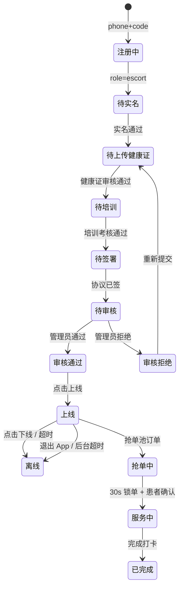

# L2 v1.0 — 陪诊师 App (escort-app) 设计

> **For spec reviewers:** 这是 L2 v1.0 前端的**陪诊师 App**（iOS + Android 跨端）详细设计。依赖 `l2-api-gap-design.md` 提供的后端 API 契约。

**Goal:** 陪诊师全生命周期工具（注册 → 培训 → 抢单 → 服务 → 钱包），产出 iOS App Store + Android APK / aab。

**Tech Stack:**
- **框架**: Flutter 3.24+（Dart 3.5）
- **状态管理**: Riverpod 2.5（compile-safe + Provider 替代）
- **路由**: go_router 14.x（声明式 + 嵌套）
- **HTTP**: dio 5.7（拦截器 + 取消 + 重试）
- **本地存储**: shared_preferences + flutter_secure_storage（token）
- **地图 / 定位**: flutter_map + geolocator（OSM 不收 key）
- **图片**: image_picker + flutter_image_compress
- **推送**: firebase_messaging（v1 mock；v2 接极光/友盟）
- **测试**: flutter test（unit / widget）+ integration_test（E2E）

**前置依赖:**
- 后端：`docs/superpowers/specs/2026-09-24-l2-api-gap-design.md` P0 API
- 跨端类型：`web/openapi/contracts.yaml` → `openapi-generator-cli` 生成 Dart client

---

## 1. 功能模块（来自 docs/03 / 09.2.2）

| # | 模块 | 状态 |
|---|---|---|
| 1 | 注册 → 实名 → 健康证 → 培训考核 → 协议签署 | P0 |
| 2 | 提交审核 → 等待审核 → 通过 / 拒绝 | P0 |
| 3 | 上线 / 下线（接单池准入） | P0 |
| 4 | 抢单池（订单 Feed + 30s 锁单） | P0 |
| 5 | 接单 → 到院签到（GPS）→ 服务中 → 完成打卡 | P0 |
| 6 | 钱包 → 余额 / 冻结 / 交易记录 | P0 |
| 7 | 提现申请 → 等待打款 | P0 |
| 8 | SOS 一键报警（陪诊师侧） | P0 |
| 9 | 培训课程学习 → 考核通过记录 | P1 |
| 10 | 收到的评价 | P1 |
| 11 | 站内信（与患者沟通） | P2 |
| 12 | 资料编辑（昵称 / 头像 / 技能） | P1 |

---

## 2. 目录结构

```
escort-app/
├── lib/
│   ├── main.dart
│   ├── app.dart                          # MaterialApp + GoRouter + Riverpod
│   ├── router/
│   │   ├── app_router.dart               # go_router 配置
│   │   └── route_guards.dart             # AuthGuard / RealNameGuard / ApprovedGuard
│   ├── pages/
│   │   ├── splash/                       # 启动页（token 检查）
│   │   ├── auth/
│   │   │   ├── login_page.dart
│   │   │   └── register_page.dart
│   │   ├── onboarding/
│   │   │   ├── real_name_page.dart       # 身份证 + 姓名
│   │   │   ├── health_cert_page.dart      # 健康证上传
│   │   │   ├── training_list_page.dart
│   │   │   ├── training_video_page.dart
│   │   │   ├── training_quiz_page.dart
│   │   │   └── agreement_page.dart
│   │   ├── audit/
│   │   │   └── pending_audit_page.dart  # 等待审核结果
│   │   ├── home/                         # 主页（BottomNavBar）
│   │   │   ├── feed_page.dart            # 抢单池
│   │   │   ├── orders_page.dart          # 我的订单
│   │   │   ├── wallet_page.dart          # 钱包
│   │   │   └── profile_page.dart
│   │   ├── order/
│   │   │   ├── order_detail_page.dart    # 含 30s 锁单倒计时
│   │   │   ├── checkin_page.dart         # GPS 签到
│   │   │   └── checkout_page.dart        # 完成打卡
│   │   ├── wallet/
│   │   │   ├── withdraw_page.dart
│   │   │   └── transactions_page.dart
│   │   ├── sos/
│   │   │   └── sos_trigger_page.dart
│   │   ├── message/
│   │   │   ├── conversation_list_page.dart
│   │   │   └── chat_page.dart
│   │   └── profile/
│   │       ├── edit_profile_page.dart
│   │       └── reviews_page.dart
│   ├── widgets/
│   │   ├── order_card.dart
│   │   ├── countdown_badge.dart          # 30s 锁单倒计时
│   │   ├── rating_stars.dart
│   │   ├── status_chip.dart              # 状态机颜色
│   │   ├── gps_checkin_button.dart       # 长按 GPS 验证
│   │   └── sos_long_press.dart
│   ├── providers/                        # Riverpod
│   │   ├── auth_provider.dart
│   │   ├── order_provider.dart
│   │   ├── wallet_provider.dart
│   │   ├── message_provider.dart
│   │   └── training_provider.dart
│   ├── api/
│   │   ├── dio_client.dart                # dio 实例 + 拦截器
│   │   ├── auth_api.dart
│   │   ├── order_api.dart
│   │   ├── escort_api.dart
│   │   ├── wallet_api.dart
│   │   ├── training_api.dart
│   │   ├── sos_api.dart
│   │   ├── review_api.dart
│   │   └── message_api.dart
│   ├── models/
│   │   ├── order.dart
│   │   ├── escort_profile.dart
│   │   ├── wallet.dart
│   │   ├── withdrawal.dart
│   │   └── signal.dart
│   ├── services/
│   │   ├── token_storage.dart            # flutter_secure_storage 封装
│   │   ├── gps_service.dart              # geolocator 封装
│   │   ├── push_service.dart             # firebase_messaging mock
│   │   └── location_service.dart
│   └── utils/
│       ├── format.dart
│       ├── trace.dart
│       └── error_handler.dart
├── ios/                                  # iOS Runner.xcodeproj
├── android/                              # Android Gradle
├── assets/
├── test/
│   └── widget_test.dart
├── integration_test/
│   └── app_test.dart
├── pubspec.yaml
└── README.md
```

---

## 3. 核心页面与状态机

### 3.1 页面列表（v1.0 MVP）

| 路径 | 页面 | 说明 | 状态 |
|---|---|---|---|
| `/splash` | 启动页 | 检查 token / 引导 | P0 |
| `/auth/login` | 登录页 | 手机号 + 验证码 / 微信 | P0 |
| `/auth/register` | 注册 | 角色选 escort | P0 |
| `/onboarding/real-name` | 实名认证 | 身份证 + 姓名（mock） | P0 |
| `/onboarding/health-cert` | 健康证上传 | 图片 picker | P0 |
| `/onboarding/training` | 培训课程列表 | 视频列表 | P0 |
| `/onboarding/training/:id` | 培训视频播放 | 进度记录 | P0 |
| `/onboarding/training/:id/quiz` | 培训考核 | 5 道题，80 分通过 | P0 |
| `/onboarding/agreement` | 协议签署 | 电子签名 | P0 |
| `/audit/pending` | 等待审核 | 提示 + 客服入口 | P0 |
| `/home/feed` | 抢单池 | TopN 订单卡片 + 30s 自动刷新 | P0 |
| `/home/orders` | 我的订单 | tab: 待服务 / 服务中 / 已完成 | P0 |
| `/home/wallet` | 钱包 | 余额 + 冻结 + 提现按钮 | P0 |
| `/home/profile` | 个人中心 | 实名状态 / 评分 / 培训记录 | P0 |
| `/order/:id` | 订单详情 | 状态机进度条 + 虚拟号 + 签到按钮 | P0 |
| `/order/:id/checkin` | 到院签到 | GPS 校验 | P0 |
| `/order/:id/checkout` | 完成打卡 | 服务完成 + 提交 | P0 |
| `/wallet/withdraw` | 提现申请 | 金额 + 渠道 | P0 |
| `/wallet/transactions` | 交易记录 | 分页列表 | P0 |
| `/sos/trigger` | SOS 触发 | 长按 3s | P0 |
| `/message/list` | 站内信列表 | P2 |
| `/message/:id` | 站内信详情 | P2 |
| `/profile/edit` | 资料编辑 | 头像 / 昵称 / 技能 | P1 |
| `/profile/reviews` | 收到的评价 | P1 |

### 3.2 陪诊师档案状态机



### 3.3 抢单 → 锁单 → 服务的 30s 窗口

订单详情页：

1. 点击 "立即接单" → 调 `POST /orders/:id/accept` → 后端 `state.StatusPendingAcceptance`
3. 显示 `<Countdown :seconds="30" />`（基于 `lock_expire_at` 计算剩余秒数）
4. 倒计时归零前 → 调 `POST /orders/:id/confirm-accept` → `accepted`
5. 倒计时归零 → 后端 `ExpiredLockScanner` 自动回退 matching，本端推送通知

---

## 4. 抢单池实现

### 4.1 抢单池 Feed

```dart
// providers/order_provider.dart
final feedProvider = StreamProvider<List<OrderSummary>>((ref) {
  final api = ref.watch(orderApiProvider);
  // 每 5s 拉一次（或 SSE/v2）
  return Stream.periodic(const Duration(seconds: 5), (_) => api.feed())
      .asyncMap((future) async => await future);
});
```

### 4.2 接单按钮（带锁单确认）

```dart
// pages/home/feed_page.dart
class FeedCard extends ConsumerWidget {
  final OrderSummary order;
  const FeedCard({required this.order, super.key});

  @override
  Widget build(BuildContext context, WidgetRef ref) {
    return Card(
      child: ListTile(
        title: Text(order.hospitalName),
        subtitle: Text('${order.amount}元 · ${order.serviceStartAtText}'),
        trailing: FilledButton(
          onPressed: () => ref.read(acceptProvider(order.id).future).then((_) {
            context.go('/order/${order.id}');
          }),
          child: const Text('抢单'),
        ),
      ),
    );
  }
}
```

### 4.3 锁单倒计时

```dart
// widgets/countdown_badge.dart
class CountdownBadge extends StatefulWidget {
  final DateTime expireAt;
  const CountdownBadge({required this.expireAt, super.key});

  @override
  State<CountdownBadge> createState() => _CountdownBadgeState();
}

class _CountdownBadgeState extends State<CountdownBadge> {
  late Timer _timer;
  late Duration _remaining;

  @override
  void initState() {
    super.initState();
    _remaining = widget.expireAt.difference(DateTime.now());
    _timer = Timer.periodic(const Duration(seconds: 1), (_) {
      setState(() {
        _remaining = widget.expireAt.difference(DateTime.now());
      });
    });
  }

  @override
  Widget build(BuildContext context) {
    if (_remaining.isNegative) return const Text('已超时');
    return Chip(
      avatar: const Icon(Icons.timer, size: 16),
      label: Text('锁单剩余 ${_remaining.inSeconds}s'),
      backgroundColor: _remaining.inSeconds < 10 ? Colors.red[100] : null,
    );
  }

  @override
  void dispose() {
    _timer.cancel();
    super.dispose();
  }
}
```

---

## 5. GPS 签到

```dart
// pages/order/checkin_page.dart
class CheckinPage extends ConsumerStatefulWidget {
  final int orderId;
  const CheckinPage({required this.orderId, super.key});

  @override
  ConsumerState<CheckinPage> createState() => _CheckinPageState();
}

class _CheckinPageState extends ConsumerState<CheckinPage> {
  double? _distance;
  bool _checking = false;

  Future<void> _doCheckin() async {
    setState(() => _checking = true);
    try {
      final pos = await Geolocator.getCurrentPosition();
      final order = await ref.read(orderApiProvider).getById(widget.orderId);
      _distance = Geolocator.distanceBetween(
        pos.latitude, pos.longitude,
        order.hospitalLat, order.hospitalLng,
      );
      if (_distance! > 200) {
        // 200m 外不允许签到
        ScaffoldMessenger.of(context).showSnackBar(
          SnackBar(content: Text('距离医院 ${_distance!.toStringAsFixed(0)}m，超出 200m')),
        );
        return;
      }
      await ref.read(orderApiProvider).checkin(widget.orderId, pos.latitude, pos.longitude);
      context.go('/order/${widget.orderId}');
    } finally {
      setState(() => _checking = false);
    }
  }

  @override
  Widget build(BuildContext context) {
    return Scaffold(
      appBar: AppBar(title: const Text('到院签到')),
      body: Center(
        child: Column(
          mainAxisAlignment: MainAxisAlignment.center,
          children: [
            const Icon(Icons.location_on, size: 64),
            Text(_distance == null ? '点击签到按钮获取 GPS' : '距离医院 ${_distance!.toStringAsFixed(0)}m'),
            const SizedBox(height: 32),
            FilledButton(
              onPressed: _checking ? null : _doCheckin,
              child: const Text('GPS 签到'),
            ),
          ],
        ),
      ),
    );
  }
}
```

---

## 6. 钱包 + 提现

```dart
// providers/wallet_provider.dart
final walletProvider = FutureProvider<Wallet>((ref) async {
  return ref.read(walletApiProvider).getMyWallet();
});

// pages/wallet/withdraw_page.dart
class WithdrawPage extends ConsumerStatefulWidget {
  // ...
  Future<void> _submit() async {
    if (_amount > wallet.balance) {
      showError('余额不足');
      return;
    }
    await ref.read(walletApiProvider).withdraw(_amount, _channel);
    ref.invalidate(walletProvider);
    context.pop();
  }
}
```

---

## 7. SOS 长按触发

```dart
// widgets/sos_long_press.dart
class SosLongPress extends StatefulWidget {
  final VoidCallback onTriggered;
  const SosLongPress({required this.onTriggered, super.key});

  @override
  State<SosLongPress> createState() => _SosLongPressState();
}

class _SosLongPressState extends State<SosLongPress> with SingleTickerProviderStateMixin {
  late AnimationController _ctrl;
  Timer? _holdTimer;

  @override
  void initState() {
    super.initState();
    _ctrl = AnimationController(vsync: this, duration: const Duration(seconds: 3));
  }

  void _startHold(_) {
    _ctrl.forward(from: 0);
    _holdTimer = Timer(const Duration(seconds: 3), widget.onTriggered);
  }

  void _endHold(_) {
    _ctrl.stop();
    _holdTimer?.cancel();
    _ctrl.reset();
  }

  @override
  Widget build(BuildContext context) {
    return GestureDetector(
      onLongPressStart: _startHold,
      onLongPressEnd: _endHold,
      onLongPressCancel: _endHold,
      child: AnimatedBuilder(
        animation: _ctrl,
        builder: (_, __) => CircularProgressIndicator(value: _ctrl.value),
      ),
    );
  }
}
```

---

## 8. 状态管理

### 8.1 全局 Auth Provider

```dart
final authProvider = StateNotifierProvider<AuthNotifier, AuthState>((ref) {
  return AuthNotifier(ref.read(tokenStorageProvider));
});

class AuthNotifier extends StateNotifier<AuthState> {
  final TokenStorage _storage;
  AuthNotifier(this._storage) : super(const AuthState.unknown());

  Future<void> bootstrap() async {
    final t = await _storage.read();
    if (t == null) {
      state = const AuthState.unauthenticated();
      return;
    }
    final user = await ref.read(authApiProvider).me();
    state = AuthState.authenticated(user);
  }

  Future<void> loginByPhone(String phone, String code) async {
    final res = await ref.read(authApiProvider).login(phone, code);
    await _storage.write(res.accessToken);
    state = AuthState.authenticated(res.user);
  }
}
```

### 8.2 Route Guard

```dart
// router/route_guards.dart
final authGuardProvider = Provider<bool>((ref) {
  return ref.watch(authProvider).maybeWhen(
    authenticated: (_) => true,
    orElse: () => false,
  );
});

// 在 go_router 配置里：
GoRoute(
  path: '/home/feed',
  redirect: (context, state) {
    if (!ref.read(authGuardProvider)) return '/auth/login';
    final escort = ref.read(authProvider).user;
    if (escort.realNameVerified != true) return '/onboarding/real-name';
    if (escort.approved != true) return '/audit/pending';
    return null;
  },
  builder: (_, __) => const FeedPage(),
),
```

---

## 9. HTTP 拦截器

```dart
// api/dio_client.dart
final dioProvider = Provider<Dio>((ref) {
  final dio = Dio(BaseOptions(
    baseUrl: 'https://api.doctors.example.com/api/v1',
    connectTimeout: const Duration(seconds: 10),
    receiveTimeout: const Duration(seconds: 30),
  ));

  dio.interceptors.add(InterceptorsWrapper(
    onRequest: (options, handler) {
      final token = ref.read(tokenStorageProvider).readSync();
      if (token != null) {
        options.headers['Authorization'] = 'Bearer $token';
      }
      options.headers['X-Trace-Id'] = 'escort-${DateTime.now().millisecondsSinceEpoch}-${Random().nextInt(1000)}';
      handler.next(options);
    },
    onError: (err, handler) {
      if (err.response?.statusCode == 401) {
        ref.read(authProvider.notifier).logout();
      }
      handler.next(err);
    },
  ));

  return dio;
});
```

---

## 10. UI 设计要点

- **Material 3** 主题（Flutter 3 内置）
- **配色**：主色 #1989FA / 状态色：可用绿 #4CAF50 / 抢单中橙 #FF9800 / 已下线灰 #9E9E9E
- **字号**：14sp (caption) / 16sp (body) / 20sp (title) / 24sp (headline)
- **圆角**：12px（卡片）/ 8px（按钮）/ 999px（头像）
- **空状态**：lottie + 文案 + 主操作
- **错误处理**：dio 错误 → snackbar → 自动 retry 一次（GET 类）

---

## 11. 测试矩阵

| 类型 | 工具 | 覆盖 |
|---|---|---|
| 单元测试 | flutter test | providers / utils / models |
| Widget 测试 | flutter test + widget tester | 关键页面 |
| E2E 测试 | integration_test | 登录 / 抢单 / 接单 / 钱包 |
| 真机调试 | iOS Sim + Android Emu | 12 个 P0 页面 |

---

## 12. 构建 + CI

```bash
# 开发
flutter run -d ios         # iOS 模拟器
flutter run -d android     # Android 模拟器

# 构建
flutter build apk --release          # Android APK
flutter build appbundle --release    # Android aab
flutter build ios --release          # iOS

# 测试
flutter test
flutter test integration_test/

# 类型 / 分析
dart analyze
```

CI 必跑：`flutter analyze` / `flutter test` / `integration_test` / `openapi-validate`（生成 client 与后端一致）。

---

## 13. 性能预算

| 指标 | 目标 |
|---|---|
| 冷启动 | < 3s |
| 列表滚动 | 60 FPS |
| 包体积（iOS） | < 30 MB |
| 包体积（Android） | < 20 MB |
| 内存占用 | < 150 MB |

---

## 14. 不做 / 留 v2

| 不做 | 留给 |
|---|---|
| WebSocket 抢单池推送 | v2（v1 轮询 5s） |
| 视频陪诊（远程视频） | v3 |
| AI 抢单推荐 | v2 |
| 国际版（i18n） | v3 |
| 推送通道（极光/友盟） | v2（v1 firebase_messaging mock） |
| 离线模式 | v2 |

---

## Self-Review

- ✅ Spec 覆盖: 12 个功能模块 + 24 个页面 + 完整目录结构
- ✅ 无占位符: 每节都有具体代码示例 / 路径 / 数字
- ✅ 类型一致: 与 l2-api-gap-design.md 的 entity 对齐
- ✅ 测试矩阵: §11 给出 4 种测试方式
- ✅ YAGNI: §14 明确不做 / 留 v2

## 关联 spec

- `docs/superpowers/specs/2026-09-24-l2-api-gap-design.md`（已批）
- `docs/superpowers/specs/2026-09-24-patient-miniapp-design.md`（已批）
- `docs/superpowers/specs/2026-09-24-admin-web-design.md`（待写）