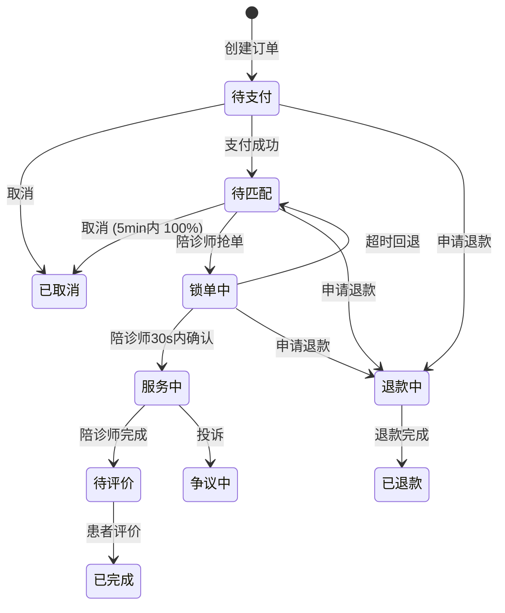

# L2 v1.0 — 患者小程序 (patient-miniapp) 设计

> **For spec reviewers:** 这是 L2 v1.0 前端的**患者微信小程序**详细设计。依赖 `l2-api-gap-design.md` 提供的后端 API 契约。

**Goal:** 实现患者陪诊全链路（注册 → 下单 → 支付 → 服务 → 评价 → 退款），产出可在微信开发者工具跑通的 v1.0。

**Tech Stack:**
- **框架**: uni-app x（Vue 3 + 组合式 API + `<script setup>`）
- **UI**: uView Plus 2.x（专为 uni-app 定制的 UI 库；兼容微信小程序 + H5）
- **状态管理**: Pinia（与 Vue 3 配套）
- **HTTP**: uni-request（基于 Promise + 拦截器；自动加 trace_id）
- **路由**: uni-app 自带 pages.json（声明式）
- **样式**: SCSS + uView 主题变量（可换肤）
- **测试**: Jest（组件）+ Playwright（H5 模式 e2e）

**前置依赖:**
- 后端：`docs/superpowers/specs/2026-09-24-l2-api-gap-design.md` 全部 P0 API
- 共享类型：`web/openapi/contracts.yaml` → `openapi-typescript` 生成

---

## 1. 功能模块（来自 docs/03 / 09.2.1）

| # | 模块 | 状态 |
|---|---|---|
| 1 | 注册 / 登录（手机号 + 微信） | P0 |
| 2 | 实名认证（mock） | P0 |
| 3 | 浏览医院 / 服务包 | P0 |
| 4 | 下单 → 微信支付（沙箱） → 支付成功 | P0 |
| 5 | 订单详情展示陪诊师虚拟号 | P0 |
| 6 | 申请退款 → 自动原路退回 | P0 |
| 7 | 服务完成 → 评价 | P0 |
| 8 | 个人中心（钱包 / 优惠券 / 地址 / 订单） | P1 |
| 9 | SOS 一键报警 | P0 |
| 10 | 站内信（与陪诊师沟通） | P2 |

---

## 2. 目录结构

```
web/patient-miniapp/
├── src/
│   ├── pages/                   # 页面（按业务分包）
│   │   ├── index/                # 首页
│   │   ├── auth/                 # 登录 / 注册 / 实名
│   │   ├── hospital/             # 医院列表 / 详情
│   │   ├── package/              # 服务包列表 / 详情
│   │   ├── order/                # 下单 / 列表 / 详情
│   │   ├── review/               # 评价表单 / 评价详情
│   │   ├── refund/               # 申请退款
│   │   ├── sos/                  # SOS 紧急信号
│   │   ├── wallet/               # 钱包
│   │   ├── coupon/               # 优惠券
│   │   ├── address/              # 地址
│   │   ├── message/              # 站内信
│   │   └── profile/              # 个人中心
│   ├── components/               # 通用组件
│   │   ├── OrderCard/            # 订单卡片
│   │   ├── EscortBadge/          # 陪诊师徽章
│   │   ├── HospitalCard/         # 医院卡片
│   │   ├── PackageCard/          # 服务包卡片
│   │   ├── PriceTag/             # 价格展示
│   │   ├── VirtualNumber/        # 虚拟号拨打
│   │   ├── Countdown/            # 30s 倒计时（陪诊师接单窗口）
│   │   └── SOSButton/            # 长按 SOS
│   ├── stores/                   # Pinia stores
│   │   ├── auth.ts               # token / 用户
│   │   ├── order.ts              # 订单列表 / 详情
│   │   ├── hospital.ts           # 医院缓存
│   │   ├── wallet.ts             # 钱包
│   │   └── message.ts            # 站内信
│   ├── api/                      # HTTP 层
│   │   ├── client.ts             # uni-request 实例
│   │   ├── auth.ts               # 登录 / 实名
│   │   ├── order.ts              # 订单 CRUD
│   │   ├── hospital.ts
│   │   ├── refund.ts
│   │   ├── review.ts
│   │   ├── sos.ts
│   │   ├── wallet.ts
│   │   └── types.ts              # 类型（手写或 codegen）
│   ├── utils/
│   │   ├── auth.ts               # token 持久化（uni.setStorageSync）
│   │   ├── trace.ts              # trace_id 生成
│   │   ├── format.ts             # 时间 / 金额格式化
│   │   └── wx.ts                 # 微信 wx.* API 封装
│   ├── App.vue
│   ├── main.ts
│   ├── manifest.json             # uni-app appid
│   └── pages.json                # 路由声明
├── __tests__/                    # Jest
├── e2e/                          # Playwright（H5 模式）
├── package.json
├── vite.config.ts
├── tsconfig.json
└── README.md
```

---

## 3. 核心页面与状态机

### 3.1 页面列表（v1.0 MVP）

| 路径 | 页面 | 说明 | 状态 |
|---|---|---|---|
| `/pages/index/index` | 首页 | 入口：搜索医院 / 我的订单入口 / 客服 | P0 |
| `/pages/auth/login` | 登录页 | 手机号 + 验证码 / 微信授权 | P0 |
| `/pages/auth/real-name` | 实名认证 | 身份证 + 姓名（mock） | P0 |
| `/pages/hospital/list` | 医院列表 | 城市筛选 + 关键词搜索 | P0 |
| `/pages/hospital/detail` | 医院详情 | 服务包列表 + 地图 | P0 |
| `/pages/package/detail` | 服务包详情 | 价格 + 描述 + 下单按钮 | P0 |
| `/pages/order/create` | 下单页 | 选择服务包 + 时间 + 地址 + 备注 | P0 |
| `/pages/order/pay` | 支付页 | 微信支付沙箱 | P0 |
| `/pages/order/list` | 订单列表 | tab: 全部 / 待支付 / 服务中 / 待评价 | P0 |
| `/pages/order/detail` | 订单详情 | 状态机进度条 + 陪诊师虚拟号 + SOS | P0 |
| `/pages/refund/apply` | 申请退款 | 选原因 + 金额预览 | P0 |
| `/pages/review/create` | 评价表单 | 评分 + 标签 + 文字 + 匿名 | P0 |
| `/pages/sos/trigger` | SOS 触发页 | 长按 3s 触发 + 定位 | P0 |
| `/pages/wallet/index` | 钱包 | 余额 + 交易记录 | P1 |
| `/pages/coupon/list` | 优惠券列表 | 可用 / 已用 / 过期 | P1 |
| `/pages/address/list` | 地址管理 | CRUD | P1 |
| `/pages/address/edit` | 地址编辑 | 省市区 + 详细地址 | P1 |
| `/pages/message/list` | 站内信会话列表 | P2 |
| `/pages/message/detail` | 会话详情 | P2 |
| `/pages/profile/index` | 个人中心 | 头像 / 实名状态 / 钱包入口 | P0 |

### 3.2 订单状态机（前端展示）



> 状态机映射到后端 `state.StatusXxx`（10 个状态）。

### 3.3 抢单倒计时（30s）

订单详情页：陪诊师抢单后展示 `<Countdown :seconds="30" />`。每次长按 SOS 展示 30s 锁单窗口。

---

## 4. API 集成（按模块）

### 4.1 鉴权

```ts
// stores/auth.ts
export const useAuthStore = defineStore('auth', () => {
  const token = ref(uni.getStorageSync('token') || '')
  const user = ref<UserSnapshot | null>(null)

  async function loginByPhone(phone: string, code: string) {
    const { data } = await authApi.login({ phone, code })
    token.value = data.access_token
    user.value = data.user
    uni.setStorageSync('token', token.value)
  }

  async function loginByWx() {
    // wx.login → code → 后端 login(wechat_code) → token
  }

  return { token, user, loginByPhone, loginByWx }
})
```

### 4.2 订单流程（下单 → 支付 → 详情）

```ts
// pages/order/create.vue
const submit = async () => {
  const { data: order } = await orderApi.create({
    hospital_id, package_id, service_start_at, address_id, remark
  })
  uni.navigateTo({ url: `/pages/order/pay?order_id=${order.id}` })
}

// pages/order/pay.vue — 调 wx.requestPayment 沙箱
const pay = async () => {
  const { data: payParams } = await orderApi.createPayment(order_id)
  // wx.requestPayment({ ...payParams, signType: 'MD5', mode: 'sandbox' })
  await orderApi.mockPayCallback(order_id) // 沙箱立即回调
  uni.redirectTo({ url: `/pages/order/detail?id=${order_id}` })
}
```

### 4.3 抢单倒计时 + 取消 + 退款

```ts
// pages/order/detail.vue
const order = ref<Order>()
const poll = ref<NodeJS.Timeout>()

onMounted(async () => {
  await loadOrder()
  // 状态机推进中（待匹配 → 锁单中 → 服务中）每 3s 轮询
  poll.value = setInterval(loadOrder, 3000)
})

const cancel = async () => {
  await orderApi.cancel(order.value.id, 'patient changed mind')
  uni.showToast({ title: '已取消' })
}

// 退款（trigger refund plan）
const applyRefund = () => {
  uni.navigateTo({ url: `/pages/refund/apply?id=${order.value.id}` })
}
```

### 4.4 SOS 长按触发

```vue
<!-- components/SOSButton/SOSButton.vue -->
<template>
  <view
    class="sos-btn"
    @touchstart="onStart"
    @touchend="onEnd"
    @touchcancel="onEnd"
  >
    长按 3 秒紧急报警
  </view>
</template>

<script setup lang="ts">
const progress = ref(0)
let timer: number | null = null

function onStart() {
  const startTs = Date.now()
  timer = setInterval(() => {
    progress.value = Math.min(100, ((Date.now() - startTs) / 3000) * 100)
    if (progress.value >= 100) {
      clearInterval(timer!)
      trigger()
    }
  }, 100) as any
}
function onEnd() {
  if (timer) clearInterval(timer)
  progress.value = 0
}
async function trigger() {
  const { lat, lng } = await wx.getLocation()
  await sosApi.create({ order_id: props.orderId, lat, lng, address: '' })
  uni.showModal({ title: 'SOS 已发出', content: '客服与紧急联系人已收到' })
}
</script>
```

---

## 5. 状态管理（Pinia）

### 5.1 store 分层

| Store | 职责 | 持久化 |
|---|---|---|
| auth | token / 当前用户 | token → uni.storage |
| order | 当前订单 + 列表缓存 | 无 |
| hospital | 医院列表缓存 | 无 |
| wallet | 钱包余额 | 无 |
| message | 会话列表 | 最近 20 条 |

### 5.2 全局错误处理

```ts
// utils/trace.ts — 拦截器自动加 trace_id
uni.addInterceptor('request', {
  request(options) {
    options.header = {
      ...options.header,
      'X-Trace-Id': `mp-${Date.now()}-${Math.random().toString(36).slice(2, 8)}`,
      'Authorization': useAuthStore().token ? `Bearer ${useAuthStore().token}` : ''
    }
    return options
  },
  responseError({ statusCode, data }) {
    if (data?.code === 11001) {  // 无 token
      useAuthStore().logout()
      uni.reLaunch({ url: '/pages/auth/login' })
    }
    return Promise.reject(data)
  }
})
```

---

## 6. UI 设计要点

- **配色**：主色 #1989FA（蓝）/ 辅 #FF6B35（陪诊师橙）/ 状态色（pending 灰 / active 蓝 / success 绿 / danger 红）
- **字号**：12px / 14px / 16px / 18px / 20px（uView Plus 预设）
- **圆角**：4px（小元素）/ 12px（卡片）/ 999px（头像）
- **间距**：8 / 16 / 24 / 32px（4 的倍数）
- **空状态**：每个列表页面提供空态插画 + 文案 + 主操作按钮
- **加载**：下拉刷新 + 上拉加载（uni-app `onPullDownRefresh` / `onReachBottom`）
- **错误兜底**：网络断开 → toast + 自动重试一次

---

## 7. 测试矩阵

| 类型 | 工具 | 覆盖 |
|---|---|---|
| 单元测试 | Jest + @vue/test-utils | 所有 components / stores / utils |
| E2E 测试 | Playwright（H5 模式） | 关键流程：登录 → 下单 → 支付 → 详情 → 退款 |
| 真机调试 | 微信开发者工具 | iOS / Android / 模拟器 |
| 截图回归 | 手工 | 10 个 P0 页面 |
| 一致性 | openapi-typescript 校验 | API client types 与后端同步

---

## 8. 构建 + CI

```bash
# 开发
npm run dev:mp-weixin          # 微信小程序

# 构建
npm run build:mp-weixin        # 输出 dist/build/mp-weixin

# 类型检查 + 单测
npm run typecheck
npm run test:unit

# E2E（启动 H5 dev server 后跑 Playwright）
npm run dev:h5 &
npm run test:e2e

# 集成：Husky pre-commit 跑 typecheck + test:unit
```

CI（GitHub Actions）必跑：`typecheck` / `test:unit` / `test:e2e` / `openapi-validate`。

---

## 9. 性能预算

| 指标 | 目标 |
|---|---|
| 首屏渲染（冷启动） | < 2s |
| 列表滚动 FPS | ≥ 50 |
| 包体积（mp-weixin） | < 2 MB |
| 网络请求（首页） | < 3 个 |
| 内存占用 | < 80 MB |

---

## 10. 不做 / 留 v2

| 不做 | 留给 |
|---|---|
| WebSocket 实时订单状态 | v2（v1 轮询 3s） |
| 小程序码分享订单 | v1.5（先做截图分享） |
| 微信支付分账 | v2 |
| 视频陪诊（远程视频） | v3 |
| AI 客服 | v3 |
| 国际化（i18n） | v3 |

---

## Self-Review

- ✅ Spec 覆盖: 10 个功能模块 + 20 个页面 + 完整目录结构
- ✅ 无占位符: 每节都有具体内容（路径 / 状态机 / 代码示例）
- ✅ 类型一致: 与 l2-api-gap-design.md 的 entity 对齐
- ✅ 测试矩阵: §7 给出 5 种测试方式
- ✅ YAGNI: §10 明确不做 / 留 v2

## 关联 spec

- `docs/superpowers/specs/2026-09-24-l2-api-gap-design.md`（已批）
- `docs/superpowers/specs/2026-09-24-escort-app-design.md`（待写）
- `docs/superpowers/specs/2026-09-24-admin-web-design.md`（待写）