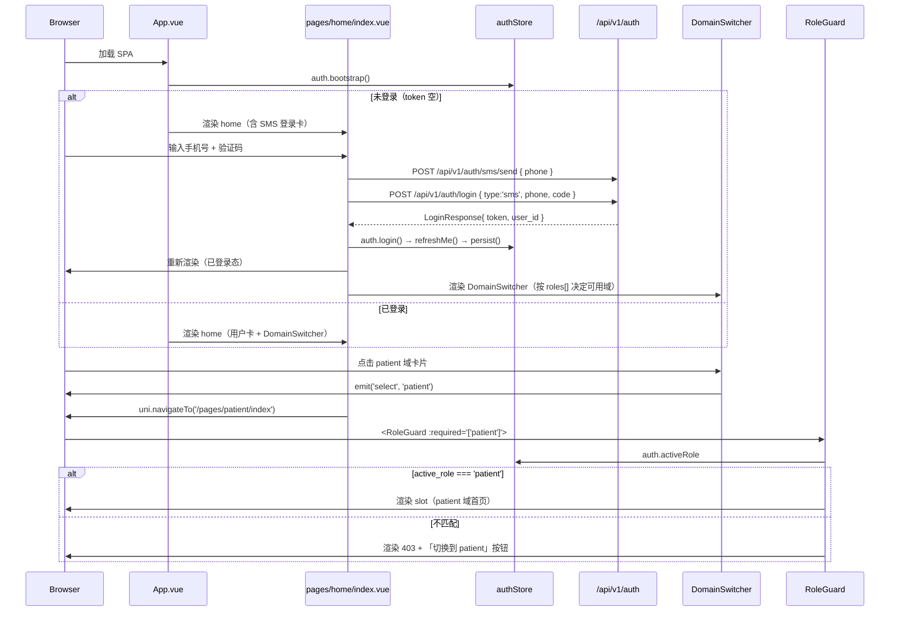
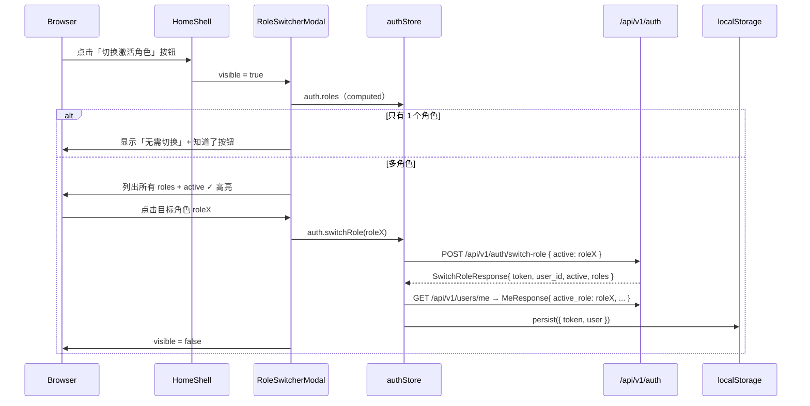
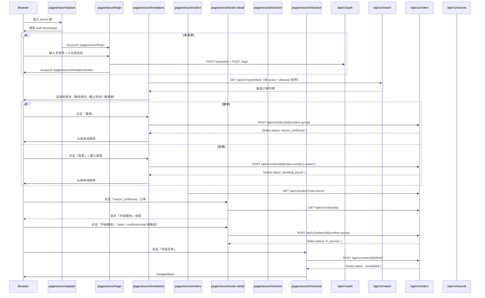
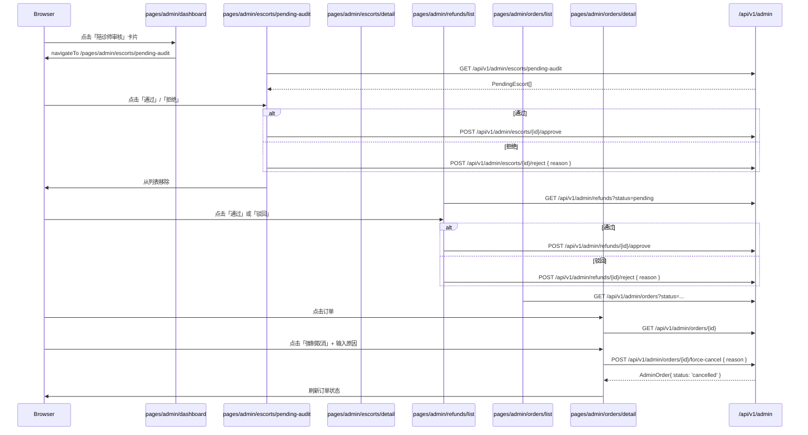
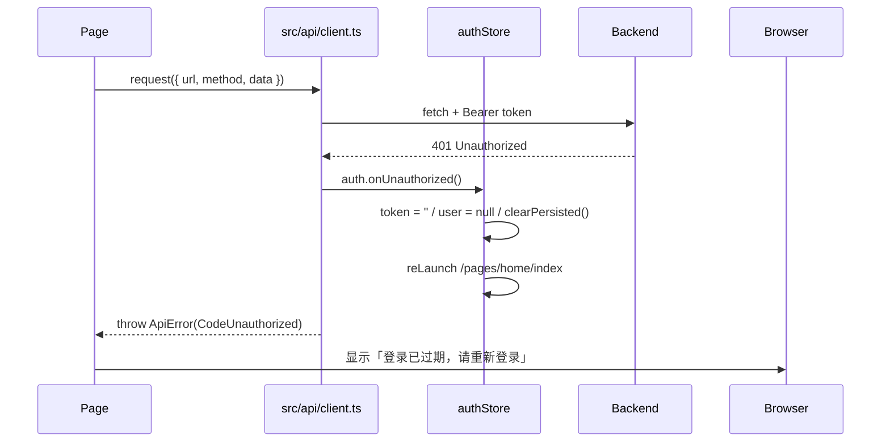

# unified-app web 设计文档 + 主要交换流程

> **范围**：v2 unified-app 的 **web (h5) 部分**（即 `pnpm build:h5` 产物）
> **入口**：`frontend/unified-app/`
> **状态**：v2.0.0 已发布（74 page / 487 tests / 0 typecheck error / build:h5 DONE）
> **对应**：
> - 架构决策源 — `docs/superpowers/specs/2026-09-28-unified-app-design.md`
> - 实施回溯 — `dev.md §45-§46`

---

## 1. 概述

### 1.1 一句话

**同一份 Vue 3 + uni-app 代码，编译为 web (h5)，支撑 3 类用户（patient / escort / admin）通过 JWT 多角色 + 前端 RoleGuard 在同一应用内切换域访问。**

### 1.2 设计目标

| 目标 | 实现 | 引用 |
| --- | --- | --- |
| 单一技术栈 | uni-app + Vue 3 + Pinia + Vite | `frontend/unified-app/package.json` |
| 3 域共享同一 codebase | 74 个 page 在 `src/pages/{home,patient,escort,admin}/` | `src/pages.json` 74 routes |
| 多角色切换 | HomeShell + RoleSwitcherModal + RoleGuard | `src/pages/home/index.vue` + `src/components/shared/RoleSwitcherModal.vue` + `src/components/shared/RoleGuard.vue` |
| 后端零改动 | 复用 v2 JWT + `/auth/switch-role` | `services/auth/handler/auth.go:153-220` |
| 设计 token 单一真相源 | `src/styles/tokens.ts` + CSS var 运行时注入 | `src/App.vue:20-33` + `src/styles/tokens.ts:117` |

---

## 2. 技术栈与目录结构

### 2.1 栈

```
Vue 3.5       (Composition API + <script setup>)
uni-app 3.0.4 (web 编译目标)
Pinia 2.1     (state)
Vite 5.4      (dev server + build)
TypeScript 5.6
Vue Test Utils 2.5 + Vitest 2.1 (单测 487 cases)
Playwright    (e2e 2 specs)
```

### 2.2 目录

```
frontend/unified-app/
├── src/
│   ├── App.vue                     # onLaunch + :root CSS-var 注入
│   ├── main.ts                     # createSSRApp + Pinia
│   ├── pages.json                  # 74 routes（flat）
│   ├── pages/
│   │   ├── home/index.vue          # HomeShell（SMS 登录 + 角色切换 + 域切换）
│   │   ├── patient/（21 子目录 + 28 page）
│   │   ├── escort/（10 子目录 + 16 page）
│   │   └── admin/（17 子目录 + 26 page）
│   ├── components/shared/         # 9 通用组件 + 2 .spec.ts
│   │   ├── UiButton.vue UiCard.vue UiInput.vue UiEmpty.vue
│   │   ├── UiLoading.vue UiModal.vue
│   │   ├── DomainSwitcher.vue RoleSwitcherModal.vue RoleGuard.vue
│   ├── api/                        # 11 client + 86 endpoints
│   │   ├── client.ts              # fetch 封装 + Bearer + 401
│   │   ├── auth.ts orders.ts match.ts payment.ts wallet.ts
│   │   ├── user.ts review.ts sos.ts message.ts admin.ts escort.ts
│   ├── store/                      # 3 Pinia store
│   │   ├── auth.ts                # token / user / activeRole / switchRole
│   │   ├── order.ts address.ts
│   ├── styles/tokens.ts            # 设计 token（TS 单一真相源 + CSS-var）
│   ├── types/auth.ts               # Role / MeResponse / SwitchRoleRequest
│   └── uni.scss
├── e2e/                            # Playwright
│   ├── home-shell.spec.ts          # HomeShell + RoleSwitcher + DomainSwitcher
│   └── login-and-switch.spec.ts    # SMS 登录 + 跨域 proxy
├── test/setup.ts                   # StorageMock + uni.* mock
├── vite.config.js                  # 16 backend proxy 规则
└── package.json
```

---

## 3. 路由与域结构

### 3.1 `pages.json` 74 路由

`src/pages.json` 用 flat 列表（不嵌套 layout），RoleGuard 在 page 内部组件级守卫。

### 3.2 三域路由示例

```
pages/home/index                    # 入口（所有角色都能进）
pages/patient/index                 # RoleGuard(['patient'])
pages/patient/auth/login            # SMS 登录
pages/patient/order/create          # 下单流
pages/patient/order/list             # 订单列表
pages/patient/order/{id}            # 订单详情
pages/patient/wallet/index          # 钱包
pages/escort/index                  # RoleGuard(['escort'])
pages/escort/invitations/index      # 抢单池
pages/escort/orders/index           # 我的任务
pages/escort/order-detail           # 任务详情
pages/escort/wallet/index           # 陪诊师钱包
pages/admin/index                   # RoleGuard(['super_admin', ...])
pages/admin/dashboard/index         # 仪表盘
pages/admin/orders/list             # 订单列表
pages/admin/escorts/pending-audit   # 陪诊审核
pages/admin/refunds/list            # 退款审批
pages/admin/finance/index           # 财务
```

### 3.3 RoleGuard 路由级守卫

`src/components/shared/RoleGuard.vue:30-46`：

```vue
<view v-if="allowed">
  <slot />
</view>
<view v-else class="ui-page">
  <view class="ui-card">
    <view class="ui-title">403 · 无访问权限</view>
    <view class="ui-subtitle">
      当前角色：{{ active || '未登录' }}；本页面要求：{{ required.join(' / ') }}
    </view>
    <u-button @click="auth.switchRole(required[0])">切换到 {{ required[0] }}</u-button>
  </view>
</view>
```

`allowed` 是 `active.value ∈ props.required`。`active` 来自 `authStore.activeRole`（即 `user.active_role`）。

### 3.4 域可用性规则（DomainSwitcher）

`src/components/shared/DomainSwitcher.vue:44-83`：

```ts
const domains = [
  { id: 'patient', entryRoles: ['patient'],         homePath: '/pages/patient/index' },
  { id: 'escort',  entryRoles: ['escort'],          homePath: '/pages/escort/index'  },
  { id: 'admin',   entryRoles: ['super_admin', 'order_admin', 'refund_admin',
                                'cs', 'audit_admin', 'viewer'],
                     homePath: '/pages/admin/index'  },
];

function isAvailable(d) {
  return d.entryRoles.some(r => auth.hasRole(r));   // 看 roles[] 包含任一
}
```

**关键点**：DomainSwitcher 不修改 active_role，只检查 `auth.roles[]` 是否含该域代表 role。点击跳域首页 + RoleGuard 兜底；用户用 RoleSwitcherModal 真正切换 active。

---

## 4. 状态管理

### 4.1 Pinia 3 store

| Store | 关键字段 | 关键 action | 引用 |
| --- | --- | --- | --- |
| **auth** | `token`, `user`, `activeRole`, `roles` | `bootstrap()`, `login(phone,code)`, `switchRole(active)`, `hasRole(r)`, `onUnauthorized()` | `src/store/auth.ts:62-129` |
| **order** | `orders[]`, `currentOrder`, `loading`, `error`, `total` | `fetchList(query)`, `fetchDetail(id)`, `create()`, `cancel()`, `confirmAccept()`, `rejectAccept()`, `finish()`, `clearError()` | `src/store/order.ts` |
| **address** | `items[]` | `fetchList()`, `create()`, `update()`, `setDefault()`, `remove()` | `src/store/address.ts` |

### 4.2 auth store 持久化

`src/store/auth.ts:26-50`：

- 存储 key：`unified.auth`（localStorage / uni.setStorageSync 双通道）
- 形态：`{ token: string, user: MeResponse }`
- `bootstrap()`：onLaunch 时调用恢复

### 4.3 auth.switchRole 关键流程

`src/store/auth.ts:93-98`：

```ts
async function switchRole(active: Role) {
  const r = await switchActiveRole(active);   // POST /api/v1/auth/switch-role
  token.value = r.token;                      // 新 JWT 替换
  await refreshMe();                          // 拉新 MeResponse（含 active_role）
  persist();                                  // 写 storage
}
```

调用方 `RoleSwitcherModal.vue:53-67` 调用，弹层 v-if/switching 状态保护。

---

## 5. 样式系统

### 5.1 设计 token 单一真相源

`src/styles/tokens.ts` 导出：
- 颜色：`uiColorPrimary`、`uiColorSuccess` 等
- 间距：`uiSpace.{xxs,xs,sm,md,base,lg,xl,xxl}`（4px 步进）
- 字号：`uiFontSize.{xs,sm,md,base,lg,xl,display}` + 字体权重
- 圆角：`uiRadius`
- 阴影：`uiShadow`
- 工具：`generateCssVarsBlock()` — 输出 `:root { --ui-color-primary: #1677ff; ... }`

### 5.2 运行时 CSS 变量注入

`src/App.vue:20-33`（双 `<script>` 块 — setup 外注入 style）：

```ts
import { generateCssVarsBlock } from '@/styles/tokens';

if (typeof document !== 'undefined') {
  const style = document.createElement('style');
  style.setAttribute('data-ui-tokens', '');
  style.textContent = generateCssVarsBlock();
  document.head.appendChild(style);
}
```

### 5.3 组件直接用 var()

```vue
<style scoped>
.btn { background: var(--ui-color-primary); padding: var(--ui-space-base); }
</style>
```

**为什么不用 SCSS**：发现 uni-app sass-loader 在 `.vue` scoped style 中 `@import` 相对路径解析失败（line 偏移 + cwd 不一致）。改用运行时 CSS 变量彻底规避。

---

## 6. 通用组件库（9 个）

| 组件 | 用途 | 关键 props |
| --- | --- | --- |
| `UiButton` | 4 type (primary/default/ghost/danger) × 3 size (sm/base/lg) + loading/block | `type`, `size`, `loading`, `block`, `disabled` |
| `UiCard` | 通用卡片容器 + title + footer slot | `title`, `shadow` |
| `UiInput` | 5 type (text/tel/number/password/textarea) + clearable/error | `modelValue`, `type`, `label`, `clearable`, `error` |
| `UiEmpty` | 空态/错误态展示 | `icon`, `title`, `description` + `#action` slot |
| `UiLoading` | loading 转圈 + 文案 | `text` |
| `UiModal` | 弹层 + title + 自定义 body/取消确认 | `v-model:visible`, `title`, `close-on-mask` |
| `DomainSwitcher` | 3 域卡片网格（active/disabled 状态） | `current-domain`, `@select` event |
| `RoleSwitcherModal` | 角色切换弹层（列出 roles[]） | `v-model:visible` |
| `RoleGuard` | 路由级角色守卫 | `required: Role[]`, `fallback-title` |

---

## 7. API 层

### 7.1 `src/api/client.ts` 核心

`request()` 自动：
1. 注入 `Authorization: Bearer ${auth.token}`
2. 401 时调 `auth.onUnauthorized()`（清 token + reLaunch home）
3. 业务错误（`code!=0`）抛 `ApiError`（带 `code`/`trace_id`）

### 7.2 11 client × 86 endpoint

| client | endpoint 数 | 主要端点 |
| --- | ---: | --- |
| auth | 5 | `/sms/send` `/login` `/switch-role` `/users/me` `/users/real-name/auth` |
| orders | 8 | `create` `select-escort` `cancel` `list` `get` `confirm-accept` `reject-accept` `finish` |
| match | 3 | `/feed` `/candidates` `/dispatch` |
| payment | 4 | `create` `getStatus` `refund` `refunds/list` |
| wallet | 7 | `users/me/wallet` `escorts/me/wallet` `wallet/transactions` `withdraw` `approve/pay/reject` |
| user | 18 | `addresses` `coupons` `hospitals` `packages` `real-name` 等 |
| review | 4 | `create` `list` `get` `reply` |
| sos | 4 | `trigger` `list` `resolve` `cancel` |
| message | 4 | `list` `get` `send` `/broadcast` |
| admin | 13 | `users` `orders` `escorts/pending-audit` `refunds` `work-orders` `billings` `reports/overview` 等 |
| escort | 14 | `register` `get` `availability` `qualifications` `trainings` `me/location` `me/city` 等 |

### 7.3 Vite 跨域代理（16 后端规则）

`vite.config.js:29-51`：

```
/api/v1/auth       → http://127.0.0.1:8081  (auth-service)
/api/v1/users      → http://127.0.0.1:8081  (auth-service: /me 在内)
/api/v1/orders     → http://127.0.0.1:8082  (order-service)
/api/v1/match      → http://127.0.0.1:8083  (match-service)
/api/v1/messages   → http://127.0.0.1:8084  (message-service)
/api/v1/payments   → http://127.0.0.1:8085  (payment-service)
/api/v1/reviews    → http://127.0.0.1:8086  (review-service)
/api/v1/sos        → http://127.0.0.1:8087  (sos-service)
/api/v1/coupons    → http://127.0.0.1:8088  (user-service)
/api/v1/me/        → http://127.0.0.1:8088
/api/v1/hospitals  → http://127.0.0.1:8088
/api/v1/packages   → http://127.0.0.1:8088
/api/v1/virtual-numbers → http://127.0.0.1:8088
/api/v1/address    → http://127.0.0.1:8088
/api/v1/escorts    → http://127.0.0.1:8089  (escort-service)
/api/v1/wallet     → http://127.0.0.1:8090  (wallet-service)
/api/v1/admin      → http://127.0.0.1:8091  (admin-service)
```

11 个后端 Go service 各自独立路由；前端用 URL 路径前缀做反向代理。

---

## 8. 主要交换流程

### 8.1 启动 → 登录 → 选域（最关键）



**关键约束**：
- DomainSwitcher 内部**不**改 active_role，只检查 roles[] 是否包含目标域代表 role
- 真正的 active_role 切换只能通过 RoleSwitcherModal（弹层里点角色 → 调 `auth.switchRole` → 调 `/auth/switch-role` → 拿新 token + 重刷 /me）
- RoleGuard 在 page 内部组件级守卫，failed 时显示「切换到 X」一键直达

### 8.2 角色切换



### 8.3 患者下单核心流

```mermaid
sequenceDiagram
  participant Browser
  participant Home as pages/home/index
  participant Hosp as pages/patient/hospitals
  participant Create as pages/patient/order/create
  participant Pay as pages/patient/order/pay
  participant OrderSvc as /api/v1/orders
  participant MatchSvc as /api/v1/match
  participant PaySvc as /api/v1/payments
  participant WalletSvc as /api/v1/wallet

  Browser->>Home: 点击患者域
  Home->>Browser: navigateTo /pages/patient/index
  Browser->>Hosp: 点击「选医院下单」或快捷入口
  Hosp->>OrderSvc: GET /api/v1/hospitals?city=北京
  Hosp-->>Browser: 医院列表
  Browser->>Hosp: 点击「协和医院」
  Hosp->>OrderSvc: GET /api/v1/hospitals/{id} 详情 + GET /packages?hospital_id={id}
  Hosp-->>Browser: 套餐列表
  Browser->>Hosp: 选择套餐 A（¥299）
  Hosp->>Browser: navigateTo /pages/patient/order/create?hospitalId=&packageId=

  Create->>OrderSvc: GET /api/v1/users/me/address（addressStore.fetchList）
  Create->>OrderSvc: GET /api/v1/users/me/coupons（listMyCoupons）
  Create->>MatchSvc: POST /api/v1/match/candidates { order_id: 0 }  # 提前看候选
  MatchSvc-->>Create: 候选陪诊师列表
  Create->>Browser: 渲染「地址 + 时间 + 备注 + 优惠券 + 候选预览」

  Browser->>Create: 点击「提交订单」
  Create->>OrderSvc: POST /api/v1/orders { hospital_id, package_id, appointment_time, address, remark }
  OrderSvc-->>Create: Order{ id: 1001, status: 'pending_escort' }
  Create->>Browser: navigateTo /pages/patient/order/pay?id=1001

  Pay->>PaySvc: POST /api/v1/payments { order_id: 1001, amount: 29900, method: 'wallet' }
  PaySvc-->>Pay: Payment{ id, status: 'paid' }（扣 user 钱包）
  Pay->>WalletSvc: 钱包余额扣减（事务内）
  Pay->>Browser: 显示「支付成功」+ 跳转订单详情
```

**状态机**（`src/store/order.ts` + 后端 services/order）：
```
pending_escort → (陪诊师 confirmAccept) → escort_confirmed
                                         → (陪诊师 confirmAccept 再触发) → in_service
                                         → (陪诊师 finishOrder) → completed
任一状态 → (patient/escort cancel) → cancelled
```

### 8.4 陪诊师抢单 → 服务 → 完成



**checkin 简化**：`src/pages/escort/checkin/index.vue` 调 `updateLocation`（escort-service `/me/location` PATCH）模拟 GPS 上报。生产应补 order-service 专用 `/checkin` 端点。

### 8.5 管理员审批流



### 8.6 401 降级



401 在**任何页面**的**任何 API 调用**触发，都会自动跳 home（`src/api/client.ts:50-53` + `src/store/auth.ts:104-109`）。

---

## 9. 测试架构

### 9.1 三层金字塔

```
487 vitest tests (61 files)
├─ API 单测 12 files  × 12-20 cases  = 80+ cases  (request url/method/body 序列化)
├─ Store 单测 3 files (auth/order/address) = ~30 cases
├─ 通用组件 6 files (UiButton/UiCard/UiInput/UiEmpty/UiLoading/UiModal) = ~40 cases
├─ 域 page 单测 ~40 files = ~330 cases (mount + 交互 + 三态)
└─ tokens / sync / smoke = 7 cases

2 Playwright e2e
├─ home-shell.spec.ts   (HomeShell + RoleSwitcher + DomainSwitcher)
└─ login-and-switch.spec.ts (SMS 登录 + 跨域 proxy)
```

### 9.2 Mock 策略

- API：`vi.mock('@/api/<client>', ...)` 替换整个模块
- Store：`vi.mock('@/api/...')` + `setActivePinia(createPinia())`
- UiInput 内部 textarea/input 是真表单元素，jsdom 下 setValue 必须透到内部 `[data-testid="ui-input-textarea"]`
- uni.* API：`test/setup.ts` 的 `StorageMock` + `globalThis.uni = { navigateTo, ... }`

### 9.3 CI

`.github/workflows/ci.yml` 中 unified-app job：

```yaml
- name: unified-app
  directory: frontend/unified-app
  setup: node-pnpm
  command: pnpm install && pnpm typecheck && pnpm test && pnpm build:h5
```

---

## 10. 部署

### 10.1 Docker

`frontend/unified-app/Dockerfile`（多阶段）：
```
node:20-alpine (corepack pnpm@9) → pnpm install + pnpm build:h5
nginx:1.80-alpine (SPA root + try_files fallback + gzip)
HEALTHCHECK: wget http://127.0.0.1/
```

### 10.2 docker-compose.deploy.yml

```
unified-app:80:80    # 1 个前端服务（v2 单 codebase）
+ 11 个后端 Go service（auth:8081 order:8082 match:8083 message:8084
   payment:8085 review:8086 sos:8087 user:8088 escort:8089
   wallet:8090 admin:8091）
+ postgres:16-alpine + redis:7-alpine
```

### 10.3 local dev

```
cd frontend/unified-app
pnpm install
pnpm dev:h5        # vite dev server :5174 + 16 backend proxy 规则
```

确保本地 11 个后端 service + postgres + redis 都启动（推荐 `cd docs/.. && docker compose -f docker-compose.deploy.yml up`）。

---

## 11. 已知占位 / Mock（明确标注）

| 位置 | 占位 | 原因 |
| --- | --- | --- |
| `pages/admin/coupons/index.vue` | 「创建优惠券」点 toast | v2 admin-service 无 CRUD 端点（跳 patient 域） |
| `pages/admin/messages/index.vue` | 「群发消息」点 toast | 同上 |
| `pages/admin/reviews/index.vue` | 「评价审核」点 toast | 同上 |
| `pages/admin/sos/index.vue` | 「SOS 工单列表」点 toast | 同上 |
| `pages/admin/settings/index.vue` | 仅展示只读配置 | 同上 |
| `pages/escort/checkin/index.vue` | `updateLocation` 模拟 GPS 签到 | v2 order-service 无 `/checkin` 端点 |
| `pages/escort/audit-pending.vue` | 24h mock 倒计时 | v2 escort-service 无审核状态查询端点 |
| `pages/escort/message/chat.vue` | 仅展示通知详情 | v2 message-service 无 1:1 chat 端点 |

> 端点补齐后只需修改对应 page 的 API 调用，占位 toast/跳转代码可直接删除。

---

## 12. 参考文件索引

| 主题 | 引用 |
| --- | --- |
| 入口 | `src/main.ts` `src/App.vue` |
| 路由 | `src/pages.json` |
| Auth | `src/store/auth.ts` `src/api/auth.ts` `src/types/auth.ts` |
| HTTP | `src/api/client.ts` |
| 域切换 | `src/components/shared/DomainSwitcher.vue` `RoleSwitcherModal.vue` `RoleGuard.vue` |
| 设计 token | `src/styles/tokens.ts` |
| 通用组件 | `src/components/shared/Ui*.vue` |
| Vite proxy | `vite.config.js` |
| Home | `src/pages/home/index.vue` |
| Dockerfile | `frontend/unified-app/Dockerfile` |
| CI | `.github/workflows/ci.yml` |
| Compose | `docker-compose.deploy.yml` |